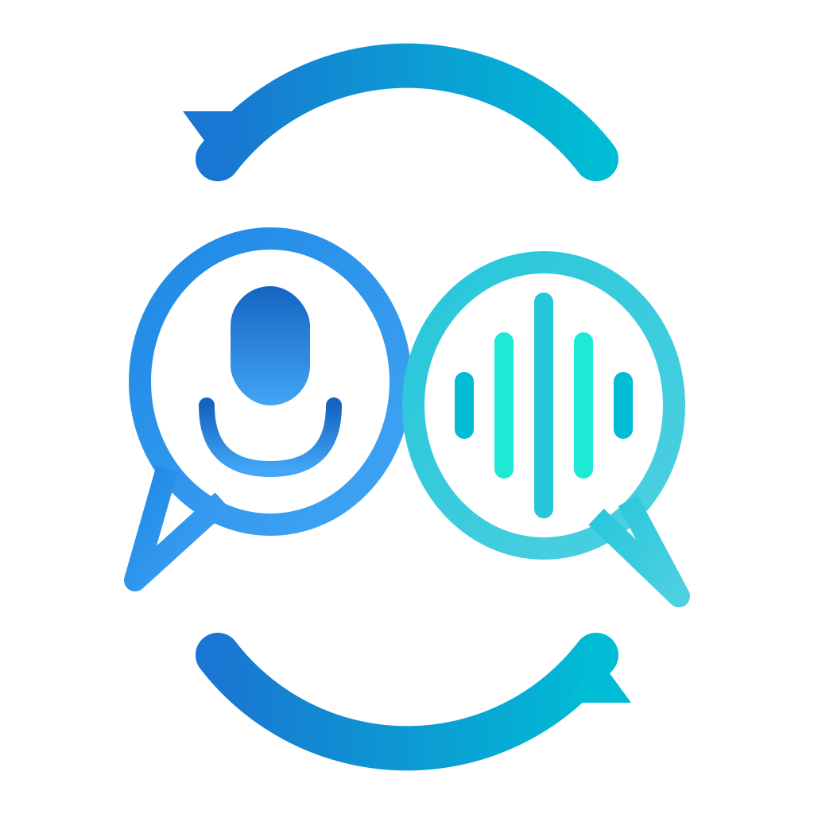

<p align="center">
  
</p>

<h1 align="center">Real-Time Call Translator</h1>

<p align="center">
  <strong>AI-powered multilingual voice communication for seamless cross-language conversations</strong>
</p>

<p align="center">
  
  
  
  
</p>

<p align="center">
  
  
  
</p>

---

## Demo

<!--
  VIDEO PLACEHOLDER
  Replace the image below with your demo video:

  Option 1 - YouTube embed (recommended):
  [](https://www.youtube.com/watch?v=YOUR_VIDEO_ID)

  Option 2 - Direct video link:
  https://github.com/user-attachments/assets/YOUR_VIDEO_ID

  Option 3 - GIF:
  
-->

<p align="center">
  
</p>

<p align="center">
  <em>Demo video will be added here</em>
</p>

---

## Features

- **Real-Time Translation** - Speak naturally and hear translations instantly with minimal latency
- **Multi-Language Support** - Hebrew, English, and Russian
- **Multi-Party Calls** - Connect 2-4 participants, each speaking their preferred language
- **Live Captions** - See real-time transcriptions as participants speak
- **Contact Management** - Add contacts, send/accept friend requests, favorites, and blocking
- **Voice Profile** - Record voice samples for personalized experience
- **Light/Dark Theme** - Comfortable viewing in any lighting condition
- **Call History** - View past calls and participants

---

## Tech Stack

| Layer | Technologies |
|-------|-------------|
| **Mobile App** | Flutter 3.x, Dart, Provider State Management |
| **Backend API** | FastAPI, Python 3.11, WebSockets, Uvicorn |
| **Database** | PostgreSQL 15, Redis 7 (caching & message broker) |
| **AI Services** | Google Cloud Speech-to-Text, Translation API, Text-to-Speech, Vertex AI |
| **Infrastructure** | Docker, Docker Compose, Alembic (migrations) |

---

## Architecture

```
┌─────────────────┐     WebSocket      ┌─────────────────┐     gRPC/REST     ┌─────────────────┐
│                 │◄──────────────────►│                 │◄─────────────────►│                 │
│   Flutter App   │    Audio Stream    │  FastAPI Server │   AI Processing   │  Google Cloud   │
│                 │◄──────────────────►│                 │◄─────────────────►│    Platform     │
└─────────────────┘     Translated     └────────┬────────┘                   └─────────────────┘
                        Audio                   │                             • Speech-to-Text
                                                │                             • Translation
                                         ┌──────┴──────┐                      • Text-to-Speech
                                         │             │                      • Vertex AI
                                    ┌────┴────┐  ┌─────┴────┐
                                    │PostgreSQL│  │  Redis   │
                                    │    DB    │  │  Cache   │
                                    └──────────┘  └──────────┘
```

---

## Getting Started

### Prerequisites

- **Docker** & **Docker Compose** (for backend)
- **Flutter SDK** 3.0+ (for mobile app)
- **Google Cloud Platform** account with enabled APIs:
  - Cloud Speech-to-Text
  - Cloud Translation
  - Cloud Text-to-Speech
  - Vertex AI (optional, for context resolution)

### Backend Setup

1. **Clone the repository**
   ```bash
   git clone https://github.com/your-username/Real-Time-Call-Translator.git
   cd Real-Time-Call-Translator/backend
   ```

2. **Configure environment**
   ```bash
   cp .env.example .env
   # Edit .env with your configuration (see comments in file)
   ```

3. **Add Google Cloud credentials**
   ```bash
   # Place your service account JSON file at:
   # backend/app/config/google-credentials.json
   ```

4. **Start services**
   ```bash
   docker-compose up -d
   ```

5. **Verify the API is running**
   ```bash
   curl http://localhost:8000/health
   ```

### Mobile App Setup

1. **Navigate to mobile directory**
   ```bash
   cd ../mobile
   ```

2. **Install dependencies**
   ```bash
   flutter pub get
   ```

3. **Run the app**
   ```bash
   # Default: connects to localhost:8000
   flutter run

   # Or specify backend host at compile time:
   flutter run --dart-define=BACKEND_HOST=192.168.1.100
   ```

4. **Configure server (optional)**
   - Backend host/port can also be configured in the app's Settings screen

---

## Project Structure

```
Real-Time-Call-Translator/
├── backend/
│   ├── app/
│   │   ├── api/            # REST & WebSocket endpoints
│   │   ├── config/         # Settings & credentials
│   │   ├── models/         # SQLAlchemy ORM models
│   │   ├── schemas/        # Pydantic validation schemas
│   │   ├── services/       # Business logic & GCP integrations
│   │   └── main.py         # FastAPI application entry
│   ├── alembic/            # Database migrations
│   ├── tests/              # Backend unit tests
│   ├── docker-compose.yml  # Container orchestration
│   └── Dockerfile          # Backend container image
│
├── mobile/
│   ├── lib/
│   │   ├── config/         # App configuration & theming
│   │   ├── core/           # Core utilities
│   │   ├── data/           # Data layer (API services, WebSocket)
│   │   ├── models/         # Data models (User, Call, Contact, etc.)
│   │   ├── providers/      # State management (Provider)
│   │   ├── screens/        # UI screens (auth, call, contacts, settings)
│   │   ├── services/       # Audio recording & playback
│   │   ├── utils/          # Helper utilities
│   │   ├── widgets/        # Reusable UI components
│   │   └── main.dart       # Flutter app entry
│   ├── android/            # Android platform files
│   ├── ios/                # iOS platform files
│   ├── web/                # Web platform files
│   └── windows/            # Windows platform files
│
└── docs/                   # Documentation
```

---

## Authors

**Amir Mishayev** & **Daniel Fraimovich**

BSc Software Engineering Capstone Project
**Braude College of Engineering**, Israel

---

## License

This project is an academic capstone project. **All rights reserved.**

This software was developed as part of a BSc degree requirements and is not licensed for commercial use, modification, or redistribution without explicit permission from the authors.

---

## Acknowledgments

- **Google Cloud Platform** - For providing the AI/ML services powering real-time translation
- **Braude College of Engineering** - For academic guidance and support
- The open-source communities behind Flutter, FastAPI, and all dependencies used in this project
