# 🎙️ Real-Time Call Translation Pipeline - Deep Dive

> **Final Presentation Documentation**  
> A comprehensive technical walkthrough of how audio is sent, processed, and delivered in the Real-Time Call Translator system.

---

## 📋 Executive Summary

This project implements a **real-time voice translation pipeline** that enables users speaking different languages to communicate seamlessly. The system captures audio from one device, transcribes it (Speech-to-Text), translates it, synthesizes the translation (Text-to-Speech), and plays it on the recipient's device - all in approximately **1-1.5 seconds**.

```mermaid
flowchart LR
    subgraph Client["📱 Mobile Client"]
        MIC[🎤 Microphone] --> ACCUM[Accumulator]
        ACCUM --> WS_SEND[WebSocket Send]
    end
    
    subgraph Server["☁️ Backend Server"]
        WS_RECV[WebSocket Receive] --> REDIS[Redis Stream]
        REDIS --> WORKER[Audio Worker]
        WORKER --> STT[Speech-to-Text]
        STT --> TRANS[Translation]
        TRANS --> TTS[Text-to-Speech]
        TTS --> PUBSUB[Redis Pub/Sub]
    end
    
    subgraph Recipient["📱 Recipient Client"]
        PUBSUB --> ORCH[Orchestrator]
        ORCH --> BUFFER[Jitter Buffer]
        BUFFER --> SPEAKER[🔊 Speaker]
    end
    
    WS_SEND --> WS_RECV
```



---

## 🏗️ Architecture Overview

### System Components

| Layer | Component | Technology | Responsibility |
|-------|-----------|------------|----------------|
| **Client** | Mobile App | Flutter/Dart | Audio capture, UI, playback |
| **Transport** | WebSocket | FastAPI | Bidirectional real-time communication |
| **Server** | Orchestrator | Python/asyncio | Session management, routing |
| **Queue** | Redis | Redis Streams + Pub/Sub | Message passing, decoupling |
| **Worker** | Audio Worker | Python | STT → Translation → TTS |
| **AI** | GCP Pipeline | Google Cloud APIs | Speech, Translation, TTS |

### Key Design Patterns

1. **Producer-Consumer Pattern** - WebSocket → Redis Stream → Worker
2. **Observer Pattern** - Redis Pub/Sub for result delivery
3. **Pause-Based Chunking** - Intelligent sentence boundary detection
4. **Context-Aware Translation** - Conversation history for coherent translations
5. **Multi-Party Support** - Translation deduplication, per-language routing

---

## 📱 Phase 1: Client-Side Audio Capture

### Component: [AudioController](file:///d:/studies/Final%20Project/Real-Time-Call-Translator/mobile/lib/providers/audio_controller.dart)

The `AudioController` manages the complete audio lifecycle on the mobile device.

### Audio Configuration

```dart
// Audio settings optimized for speech recognition
encoder: pcm16bits      // 16-bit PCM (linear)
sampleRate: 16000       // 16 kHz (Google STT optimal)
numChannels: 1          // Mono (voice only)
echoCancel: true        // AEC for speaker playback
noiseSuppress: true     // Background noise reduction
autoGain: true          // Consistent volume levels
```

### Audio Flow


### Key Implementation Details

**Chunk Accumulation Strategy** (Lines 300-340):
```dart
// Timer fires every 150ms
_sendTimer = Timer.periodic(
  Duration(milliseconds: 150),
  (_) => _sendAccumulatedAudio(),
);

void _sendAccumulatedAudio() {
  if (_accumulatedChunks.isEmpty || _isMuted) return;
  
  final audioData = Uint8List.fromList(_accumulatedChunks);
  _wsService.sendAudio(audioData);  // Binary WebSocket frame
  _accumulatedChunks.clear();
}
```

**Why 150ms?**
- **Too short (50ms)**: Network overhead dominates, fragmented speech
- **Too long (500ms)**: Noticeable delay before processing starts
- **150ms**: Balance of low latency and efficient batching (~2400 samples @ 16kHz)

### Jitter Buffer for Playback

The client maintains a **jitter buffer** to smooth playback:

```dart
// Buffering strategy
_minBufferSize = 1;   // Min chunks before playback starts
_maxBufferSize = 8;   // Max buffered chunks (drop old if exceeded)

// Playback timer (20ms intervals)
_playbackTimer = Timer.periodic(Duration(milliseconds: 20), (_) {
  if (_audioBuffer.isNotEmpty) {
    _audioPlayer.uint8ListSink?.add(_audioBuffer.removeFirst());
  }
});
```

---

## 🔌 Phase 2: WebSocket Transport

### Component: [WebSocketService](file:///d:/studies/Final%20Project/Real-Time-Call-Translator/mobile/lib/data/websocket/websocket_service.dart)

### Connection Flow

```mermaid
sequenceDiagram
    participant Client as 📱 Mobile
    participant WS as WebSocket
    participant Server as 🖥️ FastAPI

    Client->>Server: Connect(sessionId, token, callId)
    Server->>Server: Authenticate JWT
    Server->>Server: Load participant info
    Server-->>Client: { type: "connected", session_id, call_language }
    
    loop Heartbeat (every 5s)
        Client->>Server: { type: "heartbeat" }
        Server-->>Client: { type: "heartbeat_ack" }
    end
    
    Client->>Server: Binary (audio bytes)
    Server-->>Client: JSON (translation)
    Server-->>Client: Binary (TTS audio)
```



### Message Types

| Direction | Type | Format | Content |
|-----------|------|--------|---------|
| Client → Server | Audio | Binary | Raw PCM16 bytes |
| Client → Server | Control | JSON | `{type: "mute", muted: true}` |
| Client → Server | Heartbeat | JSON | `{type: "heartbeat"}` |
| Server → Client | Translation | JSON | transcript, translation, speaker_id |
| Server → Client | Audio | Binary | TTS PCM16 bytes |
| Server → Client | Interim | JSON | Real-time typing preview |

### Reconnection with Exponential Backoff

```dart
Duration _getBackoffDelay(int attempt) {
  // 2s → 4s → 8s → 16s → max 32s
  return Duration(seconds: min(32, pow(2, attempt + 1)));
}
```

---

## 🎛️ Phase 3: Server-Side Orchestration

### Component: [CallOrchestrator](file:///d:/studies/Final%20Project/Real-Time-Call-Translator/backend/app/services/session/orchestrator.py)

The orchestrator manages each WebSocket connection's lifecycle.

### Session Lifecycle


### Binary Audio Handler (Lines 366-401)

```python
async def _handle_binary_message(self, audio_data: bytes):
    # Validate minimum size
    if len(audio_data) < 100:
        return
    
    # Get source language from participant
    source_lang = self.participant_info.get("participant_language")
    source_lang = _normalize_language_code(source_lang)  # he → he-IL
    
    # Publish to Redis Stream for Worker processing
    await publish_audio_chunk(
        session_id=self.session_id,
        chunk=audio_data,
        source_lang=source_lang,
        speaker_id=self.user_id
    )
```

### Redis Pub/Sub Listener (Lines 513-553)

Each orchestrator subscribes to its session's translation channel:

```python
async def _listen_for_translations(self):
    channel_name = f"channel:translation:{self.session_id}"
    
    redis = await get_redis()
    pubsub = redis.pubsub()
    await pubsub.subscribe(channel_name)
    
    async for message in pubsub.listen():
        if message["type"] == "message":
            data = json.loads(message["data"])
            await self._handle_translation_result(data)
```

---

## ⚙️ Phase 4: Audio Processing Worker

### Component: [audio/worker.py](file:///d:/studies/Final%20Project/Real-Time-Call-Translator/backend/app/services/audio/worker.py)

The worker is the core of the translation pipeline, consuming audio from Redis Streams.

### Worker Architecture


### Stream Consumption Loop (Lines 663-712)

```python
async def run_worker():
    stream_key = "stream:audio:global"
    group_name = "audio_processors"
    consumer_name = f"worker_{os.getpid()}"
    
    while not _shutdown_flag:
        # Block-read from Redis Stream
        streams = await redis.xreadgroup(
            group_name,
            consumer_name,
            {stream_key: ">"},
            count=10,       # Process 10 messages at a time
            block=1000      # Wait up to 1 second
        )
        
        for stream, messages in streams:
            for message_id, data in messages:
                await process_stream_message(redis, stream, message_id, data)
```

---

## 🔪 Phase 5: Intelligent Audio Chunking

### Component: [audio/chunker.py](file:///d:/studies/Final%20Project/Real-Time-Call-Translator/backend/app/services/audio/chunker.py)

The `AudioChunker` implements pause-based segmentation for natural sentence boundaries.

### Chunking Algorithm

```mermaid
flowchart TD
    FEED[Feed Audio Chunk] --> DETECT{Speech Detected?}
    DETECT -->|Yes| UPDATE_VOICE[Update last_voice_time]
    DETECT -->|No| CHECK_SILENCE{Silence > 0.4s?}
    
    UPDATE_VOICE --> CHECK_MAX{Accumulated > 2.5s?}
    CHECK_SILENCE -->|Yes| ENOUGH{Buffer > min bytes?}
    CHECK_SILENCE -->|No| WAIT[Continue buffering]
    
    CHECK_MAX -->|Yes| PROCESS[⚡ Process Now!]
    ENOUGH -->|Yes| PROCESS
    ENOUGH -->|No| WAIT
    
    PROCESS --> CALLBACK[on_chunk_ready()]
    CALLBACK --> RESET[Clear buffer, reset timers]
    RESET --> WAIT
```

### Triggering Conditions

| Trigger | Threshold | Purpose |
|---------|-----------|---------|
| **Silence Detection** | 0.4 seconds | Natural sentence boundaries |
| **Max Accumulation** | 2.5 seconds | Prevent indefinite buffering |
| **Min Audio Length** | 0.15 seconds | Avoid processing noise |

### Speech Detection (Spectral Analysis)

```python
# RMS energy threshold for voice activity
RMS_SILENCE_THRESHOLD = 350  # Calibrated for human speech

def is_speech(self, audio_bytes: bytes) -> bool:
    samples = np.frombuffer(audio_bytes, dtype=np.int16)
    rms = np.sqrt(np.mean(samples.astype(np.float64) ** 2))
    return rms > RMS_SILENCE_THRESHOLD
```

---

## 🧠 Phase 6: GCP Speech Pipeline

### Component: [gcp_pipeline.py](file:///d:/studies/Final%20Project/Real-Time-Call-Translator/backend/app/services/gcp_pipeline.py)

### Pipeline Flow

```mermaid
sequenceDiagram
    participant Worker as Audio Worker
    participant STT as Google STT
    participant Trans as Google Translate
    participant TTS as Google TTS
    participant Cache as TTS Cache

    Worker->>STT: PCM16 Audio (16kHz)
    STT-->>Worker: Transcript "שלום, מה שלומך?"
    
    Worker->>Trans: (source: he, target: en, context: ...)
    Trans-->>Worker: "Hello, how are you?"
    
    Worker->>Cache: Check cache
    alt Cache Hit
        Cache-->>Worker: Cached audio
    else Cache Miss
        Worker->>TTS: (text, voice: en-US-Standard-A)
        TTS-->>Worker: PCM16 Audio
        Worker->>Cache: Store audio
    end
    
    Worker-->>Worker: Publish to Redis Pub/Sub
```



### Speech-to-Text Configuration

```python
config = speech.RecognitionConfig(
    encoding=LINEAR16,
    sample_rate_hertz=16000,
    language_code="he-IL",
    enable_automatic_punctuation=True,
)
```

### Context-Aware Translation (Phase 4 Enhancement)

```python
def _translate_text_with_context(self, text, context_history, ...):
    # Slice context at word boundaries (max 150 chars)
    context_snippet = self._get_clean_context(context_history, 150)
    
    # Format: "[...previous context] new text"
    text_with_context = f"[...{context_snippet}] {text}"
    
    result = self._translate_text(text_with_context, ...)
    
    # Remove translated context prefix
    if result.startswith("[") and "]" in result:
        result = result[result.index("]") + 1:].strip()
    
    return result
```

**Why Context?**  
Without context, pronouns and references are ambiguous:
- "הוא אמר שהוא יבוא" → "He said **he** will come" ✅
- Without context: "He said that **it** will come" ❌

### TTS Caching (Phase 3 Optimization)

```python
# LRU cache reduces API calls for repeated phrases
cache = get_tts_cache()
cached_audio = cache.get(translation, target_lang)

if cached_audio:
    return cached_audio  # Cache hit!
else:
    audio = pipeline._synthesize(translation, ...)
    cache.put(translation, target_lang, audio)
    return audio
```

---

## 🔄 Phase 7: Multi-Party Translation

### Multi-Party Flow

```mermaid
flowchart TB
    SPEAKER[Speaker: Hebrew] --> STT[STT Once]
    STT --> QUERY[Query Recipients]
    QUERY --> TARGETS["Target Languages:<br/>User A: English<br/>User B: Russian<br/>User C: Spanish"]
    
    TARGETS --> TRANS_EN[Translate → English]
    TARGETS --> TRANS_RU[Translate → Russian]  
    TARGETS --> TRANS_ES[Translate → Spanish]
    
    TRANS_EN --> TTS_EN[TTS English]
    TRANS_RU --> TTS_RU[TTS Russian]
    TRANS_ES --> TTS_ES[TTS Spanish]
    
    TTS_EN --> PUBLISH[Publish with recipient_ids]
    TTS_RU --> PUBLISH
    TTS_ES --> PUBLISH
```



### Translation Deduplication (Lines 411-579)

```python
async def process_accumulated_audio_multiparty(...):
    # 1. Query target languages from database
    target_langs_map = await call_repository.get_target_languages(
        session_id, speaker_id, include_speaker=True
    )
    # Result: {"en-US": ["user_a", "user_b"], "ru-RU": ["user_c"]}
    
    # 2. STT once (source language)
    transcript = await transcribe(audio_data, source_lang)
    
    # 3. Translate + TTS per language (parallel)
    translation_tasks = [
        process_language(tgt_lang, recipients)
        for tgt_lang, recipients in target_langs_map.items()
    ]
    results = await asyncio.gather(*translation_tasks)
    
    # 4. Publish with recipient routing
    for result in results:
        payload = {
            "type": "translation",
            "recipient_ids": result["recipient_ids"],  # NEW!
            ...
        }
        await redis.publish(channel, json.dumps(payload))
```

---

## 📊 Latency Analysis

### End-to-End Latency Breakdown

| Stage | Target | Actual | Notes |
|-------|--------|--------|-------|
| Client accumulation | 150ms | 150ms | Fixed timer |
| Network (client→server) | 50ms | 30-100ms | Varies by connection |
| STT | <500ms | 200-400ms | Google Cloud Speech |
| Translation | <200ms | 100-150ms | Google Cloud Translate |
| TTS | <300ms | 150-250ms | Google Cloud TTS |
| Network (server→client) | 50ms | 30-100ms | Varies by connection |
| **Total** | **<1500ms** | **1000-1500ms** | ✅ Target achieved |

### Optimization Techniques

1. **Dedicated Thread Pool** - 16 workers for GCP calls prevent starvation
2. **TTS Caching** - LRU cache reduces repeat API calls
3. **Parallel Translation** - Multiple target languages processed concurrently
4. **Streaming STT** - Interim results provide real-time typing indicator
5. **Pause-Based Chunking** - Natural sentence boundaries, not fixed intervals

---

## 🔗 Component Relationships

```mermaid
graph TB
    subgraph Mobile["📱 Flutter Mobile App"]
        AP[AuthProvider] --> CP[CallProvider]
        CP --> AC[AudioController]
        CP --> WSS[WebSocketService]
        AC --> WSS
    end

    subgraph Backend["🖥️ FastAPI Backend"]
        WR[WebSocket Router] --> CO[CallOrchestrator]
        CO --> CM[ConnectionManager]
        CO --> RTC[RTC Service]
        RTC --> RS[Redis Stream]
    end

    subgraph Worker["⚙️ Audio Worker"]
        CONS[Stream Consumer] --> SM[StreamManager]
        SM --> CHUNK[AudioChunker]
        CHUNK --> SD[SpeechDetector]
        CHUNK --> TP[TranslationProcessor]
        TP --> GCP[GCPSpeechPipeline]
        TP --> CACHE[TTS Cache]
    end

    WSS <--> WR
    RS --> CONS
    TP --> PUBSUB[Redis Pub/Sub]
    PUBSUB --> CO
```



---

## 🎯 Key Algorithms Summary

### 1. Pause-Based Chunking
- **Input**: Continuous audio stream
- **Output**: Sentence-like audio segments
- **Algorithm**: Track voice activity, trigger on 0.4s silence OR 2.5s max

### 2. Context-Aware Translation
- **Input**: Transcript + conversation history
- **Output**: Coherent translation
- **Algorithm**: Append context prefix, translate, strip prefix from result

### 3. Multi-Party Routing
- **Input**: Speaker's audio, session ID
- **Output**: Per-language translations to correct recipients
- **Algorithm**: Query DB for language map, translate once per language, route by recipient_ids

### 4. Jitter Buffering
- **Input**: Variable-interval audio chunks
- **Output**: Smooth audio playback
- **Algorithm**: Buffer min chunks before playing, drop old if max exceeded

---

## 📁 Key Files Reference

| Purpose | File Path |
|---------|-----------|
| Mobile Audio Controller | [audio_controller.dart](file:///d:/studies/Final%20Project/Real-Time-Call-Translator/mobile/lib/providers/audio_controller.dart) |
| Mobile WebSocket Service | [websocket_service.dart](file:///d:/studies/Final%20Project/Real-Time-Call-Translator/mobile/lib/data/websocket/websocket_service.dart) |
| Server Orchestrator | [orchestrator.py](file:///d:/studies/Final%20Project/Real-Time-Call-Translator/backend/app/services/session/orchestrator.py) |
| Audio Worker | [worker.py](file:///d:/studies/Final%20Project/Real-Time-Call-Translator/backend/app/services/audio/worker.py) |
| Audio Chunker | [chunker.py](file:///d:/studies/Final%20Project/Real-Time-Call-Translator/backend/app/services/audio/chunker.py) |
| GCP Pipeline | [gcp_pipeline.py](file:///d:/studies/Final%20Project/Real-Time-Call-Translator/backend/app/services/gcp_pipeline.py) |
| Architecture Docs | [ARCHITECTURE.md](file:///d:/studies/Final%20Project/Real-Time-Call-Translator/docs/ARCHITECTURE.md) |

---

## 🎤 Presentation Talking Points

1. **The Challenge**: Real-time translation requires <2s end-to-end latency
2. **The Solution**: Distributed pipeline with intelligent chunking
3. **Innovation**: Pause-based segmentation respects natural speech patterns
4. **Scalability**: Redis Streams + Worker pools enable horizontal scaling
5. **Quality**: Context-aware translation produces coherent conversations
6. **Efficiency**: TTS caching and translation deduplication reduce costs
